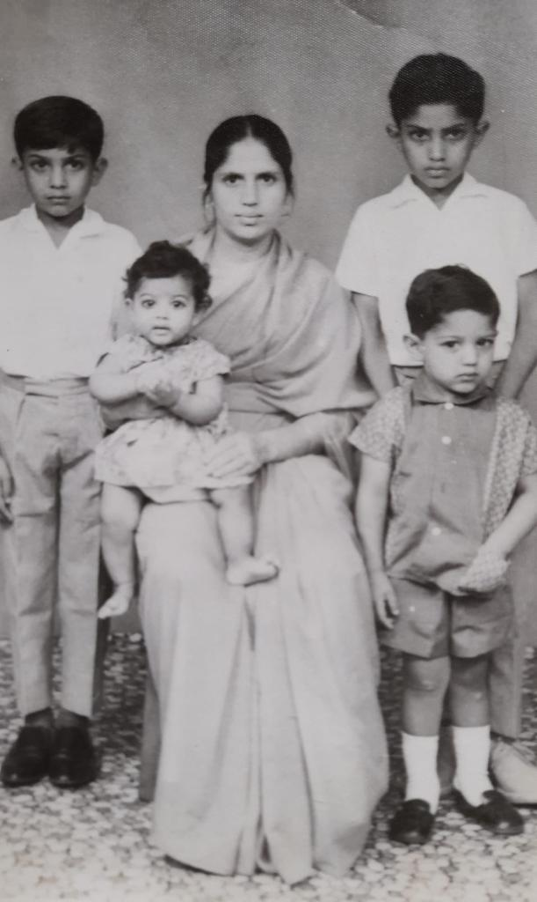

## My Thesis Simplified 

*My Family in Uganda*

I fell into history quite by chance. It was the product of an incremental tightening of my academic options, from GCSE to A Level, picked for an undergraduate degree for fickle reasons, and then adopted with an open-eyed curiosity, and later, a tentative love. It is difficult not to be appreciative of the type of history I specialise in. Indeed, I am a product of it. In short, my research is focused on collective memory and place-making among British Ugandan Asians from 1972 to the present day. I was introduced to this period of history from birth. My father is a Ugandan Asian, my family are Ugandan Asians, and I have grown up with a quiet appreciation and curiosity not only for their personal story of displacement and resettlement, but also for the wider currents of postcolonial mentalities in a decolonising world. I’m intending here to make the current direction of my thesis simple and to outline the directions I intend to take across the course of my PhD at the University of Cambridge. 

# The Context: Asians in Uganda

My project in theory starts at the point of Ugandan Asians entering Britain in 1972. A military dictator called Idi Amin (or, if you would like to refer to him by his full self-appointed title, His Excellency, President for Life, Field Marshal Al Hadji Doctor Idi Amin Dada, VC, DSO, MC, CBE, Lord of All the Beasts of the Earth and Fishes of the Seas and Conqueror of the British Empire in Africa in General and Uganda in Particular), expelled the Asian population from Uganda, giving them 90 days to leave the country. However, to understand this pivotal event, we must look backwards to the colonial period in East Africa and the wider legacies of the British Empire globally. 

During the colonial period, there was significant migration from the Indian subcontinent to East African colonies, including Uganda. These migrants were not only indentured labourers, but also merchants, traders and civil servants. In colonial Uganda, British imperialist and divide-and-rule tactics created a tripartite social structure, which encouraged Ugandan Asians to separate themselves from the African population, developing a colonial ‘sandwich’ which situated the Asian population above Black Africans and below white Europeans. Although these structures could blur and shift, the majority of interactions between Asians and Africans occurred in a commercial context, through trade and marketplace interaction. This created an intersection of race and class which became politicised, and built resentment towards this Asian minority, who in the eyes of many Black Africans, fulfilled roles of ‘sub-imperialists’. 

Following Ugandan independence in 1962, this separation continued into the postcolonial state. Many Ugandan Asians chose to retain the British citizenship they had acquired during empire rather than take Ugandan citizenship, contributing to accusations of lack of national loyalty. The Asian population became the target of significant criticisms, particularly surrounding their lack of meaningful social interaction with Africans, refusal to intermarry and ‘exploitative’ economic practices. Across postindependence Africa, including East African states, ‘Africanisation’ policies were enacted to regain control over the economy and facilitate national autonomy. These policies led to a small but significant migration of Asians from Uganda and Kenya. When I first came to study this period of history, my research was focused on race relations in postcolonial Uganda, mainly how this colonial racial hierarchy (and subsequent changing perceptions of race upon the move to Britain) impacted how Ugandan Asians interacted with Ugandan Africans. 

# The Expulsion: Ugandan Asians Come to Britain 

In 1971, Idi Amin staged a coup against the president of Uganda, Milton Obote, seizing control of the country. Amin was particularly vocal about his distrust of the Asian community and their ‘exploitative’ and ‘exclusive’ presence in Uganda. In 1972, he announced an expulsion decree, aimed primarily at non-Ugandan passport holding Asians. What followed was a mass exodus of over 50,000 Ugandan Asians, many of whom came to Britain due to their status as UKPHs. The expulsion as a pivotal event is well-explored in both public history and academic scholarship. It is important to highlight here the drastic difference in not only the material conditions of life in Uganda and Britain, but also the alternative racial structures, social expectations and emotional experiences. I consider the expulsion a ‘rupture’ event, a clear divide between before and after. 

My project is concerned with the Britain which Ugandan Asians entered. It was, to put it lightly, hostile. A series of immigration acts from the 1960s aimed to restrict the entry of non-white immigrants, particularly former colonial subjects, into the UK. Pervasive fears around the loss of white British culture were compounded by the fearmongering anti-immigration stances of politicians like Enoch Powell. Although Britain had an obligation to accept the UKPHing British Ugandan Asians under international law, the former colonial metropole tried their hardest to shift the burden onto the international community, by spinning the resettlement of Ugandan Asians from a legal obligation to a ‘humanitarian’ refugee crisis. The Uganda Resettlement Board, which was established to manage the influx of Ugandan Asians, therefore conducted the task of rehousing and resettling thousands of families within this fragile and hostile environment. 

What followed was an unofficial ‘dispersal’ policy, which divided the country into ‘red’ and ‘green’ areas. Red areas were anywhere where the board deemed resettlement would be undesirable: either due to pressure on council services or because there was already a preexisting Asian community, which would fan fears of non-white immigrant ‘takeovers’. These included many areas in London and also Leicester (who actually put out official advertisements in the Ugandan Argus, a Ugandan newspaper, to warn Ugandan Asians not to come to the city) as well as other, primarily urban, environments. ‘Green’ areas were usually counties with a smaller non-white population, more rural, and without any preexisting cultural or social structures to enable Ugandan Asians to resettle and integrate. 

# The Project: Intergenerational Memory, Place-Making and Race in 1970s Britain 

To explore the experiences of Ugandan Asians in Britain, I grapple with the collision of Uganda and Britain, colonial and metropole, while focusing on the intricacies of establishing place and community for migrant families. This is concerned not only with Ugandan Asians in white, British spaces, but also the establishment of uniquely Ugandan Asian spaces through interactions with other ethnic minority groups. I conceptualise ‘space’ and ‘place’ as conscious sites of meaning, exploring how community and identity were filtered through not only emotional and mental frames but also physical structures, such as community centres and religious institutions. Turning to broader intergenerational explorations, I employ two main threads of interest: Ugandan Asians as ‘categories of the state’, and commemorative practices. To examine Ugandan Asians as ‘categories of the state’ I interrogate the ‘success narrative’ built around Ugandan Asians, which presented them as ‘good’, educated and hardworking immigrants who would successfully integrate. Situated within the context of methods of imperial control, this narrative was utilised by the media to mitigate anti-immigration fears and subsequently benefitted the aims of the URB and British government. It is with commemorative practices that the spatial lens becomes paramount, where commemoration is used as a conscious and purposeful tool of community, memory and identity formation. Within this, I explore Ugandan Asian articulation and rearticulation of historical experience as a means of self-identification and collective community building. Essentially, I consider commemorative events, particularly those focused on anniversaries of the expulsion, as sources within their own right. How do these commemorations attest to the feeling of belonging in Britain, of making ‘space’ for migrant experience? What do they say about the roots of Ugandan Asian memory, where the focus is often centred more around 1972 as a historical pivot, rather than on longer processes of diasporic migration?

My central source base will be a collection of oral interviews. I’m not only concerned with what happened in the past, but more crucially how the past is experienced, used as a tool for ongoing identity construction and collectively remembered, or misremembered. The power dynamics inherent to the articulation, recovery and exploration of memory operate within a spatial framework. As such, spatiality as a theoretical model is needed not only as a tool for the examination of Ugandan Asian place-making, but also as a consideration in memory studies. It differentiates ‘space’ from ‘place’, with the latter representing physical spaces that have been naturalised through patterns, behaviour and communications, or more simply, created through the act of naming and imbuing with meaning. ‘Place-making’ is concerned with the conscious creation of place to serve the needs of individuals or communities, in my case to create and articulate a sense of Ugandan Asian belonging within Britain. I take these theoretical underpinnings to form a methodological basis through which I can gain a greater understanding of the day-to-day constructions of ‘space’ and ‘place’ with which Ugandan Asians negotiated their lives in Britain. Oral history, as a way of engaging with cultural memory, can be understood as a conversation between representations of the past and symbolic representations available in the present. The practice of oral history, therefore, is not about simply witnessing a participant articulate the past, but rather it is a unique form of knowledge production that is based on the exchange between myself as the interviewer and my participant. I therefore engage with ‘space’ on two levels: a historical understanding of how Ugandan Asians have negotiated spaces in Britain from 1972 to the present day, and how the space of the oral history interview shapes the creation of historical knowledge in the present moment. 

This project is one which has a lot to say to ideas of race in postimperial Britain. It intervenes in a fast-changing academic landscape which is concerned with understanding the racialised nature of 1970s Britain as a reaction to the winding up of empire. This period saw a bifurcated system (meaning forked into two separate branches) with harsh external immigration laws and emerging focus on multiculturalism, pluralism and broad citizenship rights within the country. The best way to see this is like a cream egg (hard exterior and gooey interior). This period of British history therefore lies in a longer process of imperial logics and governance. It is also interested in diasporic identities, the way the category of the ‘refugee’ was formed, and how migrant groups perceive themselves and their position in host countries. It’s a project that can only be viewed from the present moment, a history that is still very much alive and kicking. 
