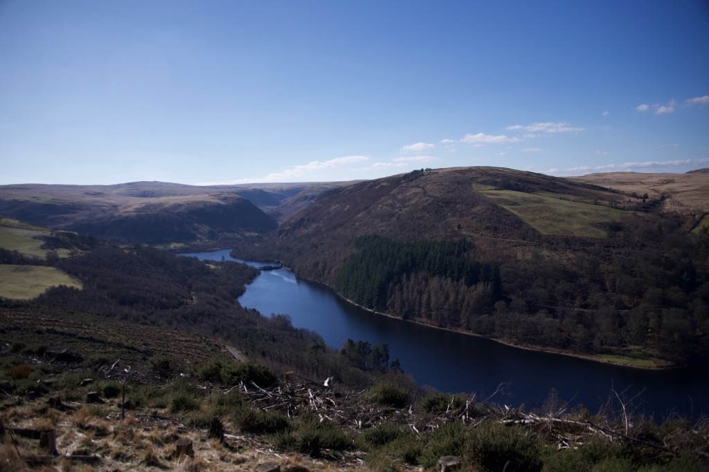

## Elan Valley

{width=70%}

In March of 2025, I visited Wales for a few nights with one of my closest friends. We had discovered a dream BnB a year before while attending the Hay Festival at Hay-on-Wye: a love letter to the world’s unapologetic book nerds. Both employed, rolling in our minimally disposable cash, we planned a trip of beautiful breakfasts, gentle strolls through the countryside and a few tasteful hours lying in bed watching every Night at the Museum. The highlight of our trip however, and almost entirely unexpected, was the six hours we got totally lost while “hiking” the stunning Elan Valley. 

{width=70%}

We started with a reasonable stroll through an established path, where I was stuck with boundless enthusiasm to the “record” function of the Merlin app. Itching for a little more adventure, we went off path, encouraged by passers-by that the loop lasted only an hour or two, and that we were, seemingly at every point “nearly there”. We had no water, no snacks (travesty!) and no signal, so for the following six hours, we were wandering about in the hope that we were travelling somewhat in the right direction of the car park. I do have to confess that my survival skills are minimal (something that I plan to rectify in the coming years) and there was one stretch of A-road with no signal that almost sent me spiralling. We met gaggles of watchful rams and a group of four boys who led us through (our Hobbit savours), a red kite and some of the most beautiful sights I have seen in Britain. I remember often the farm we passed that carried such a malevolent energy that the crazed barking still visits me in my sleep. I often have dreams that involve farms and fearful feeling. One, which I must have had when I was fifteen or younger, was simply a soundtrack of squealing pigs being slaughtered. Anyway, I digress. 

(../../images/elan-valley 2.jpg){width=70%} 