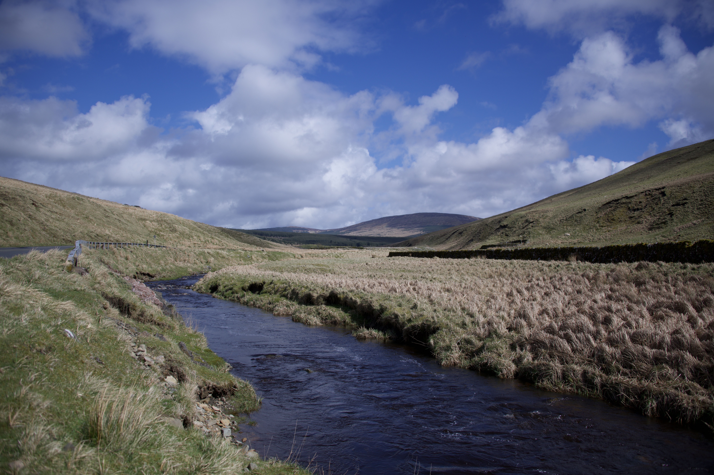

## The Borderlands

In April 2026, a friend and I completed the Northumberland 250, a route around England’s northernmost county, camping between Alnwick and Hexham. We had just under five days of travel, and mid-week hit the northernmost section of the route: The Borderlands, driving in and out of England and Scotland for a good six hours of the day. Armed with an array of snacks in the back seat (think crisp multipack, crumpets and easy peelers), we took our time, stopping intermittently to take photos or film some footage of the truly awesome landscapes. 

It was an entertaining game to guess if we were in England or Scotland, abandoning the map for a zig-zag magical mystery tour. The Scottish landscapes are astounding, there’s no question. Epic and wild, beautifully untamed, gorgeous streams and hills. Those characteristic English fields are far more regimented, controlled, tame. It says a lot about English tendencies, about the sort of control that the English exhibit over themselves and everyone else, the strait-laced, rod-back vision of civilisation that underlaid their imperial visions. There’s a lot here to criticise, but those farmers’ fields were also the background to my childhood, and I see a beauty in the English countryside that has been shared for centuries by artists and poets alike. That’s not to say that England doesn’t have its fair share of wilder landscapes. Just look at the Jurassic Coast, Cornish beaches, wild forests, those Northumberland wetlands. I thought it would be easy to tell the two countries apart, and in some ways it was, but in others they proved to be, along The Borderlands, almost indistinguishable. 

That’s not to say that there were a few points where the swap over was decisively clear. One was the border crossing point (pictured above), alongside any entry into a Scottish village, where the flags immediately gave the country away. I’d give it to them. I’m not Scottish, but I’d put up their flag before St George’s any day. The Borderlands Day was a fun foray in the trip, although the driving certainly wasn’t for the weak of heart (although as a Devon and Cornwall honorary local I’m no coward when it comes to 60mph single track with passing places). Both Scotland and England have some beautiful sights, if you’re willing to look. 