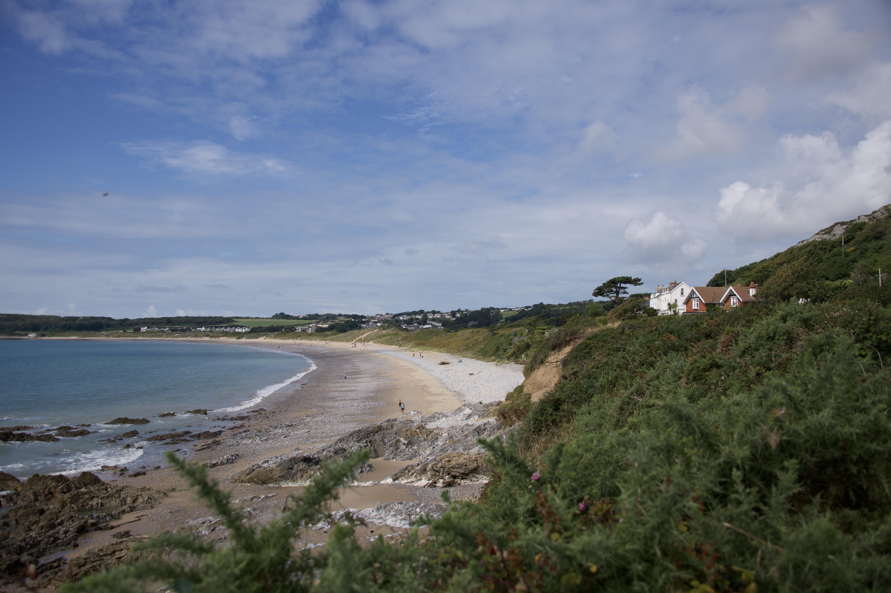
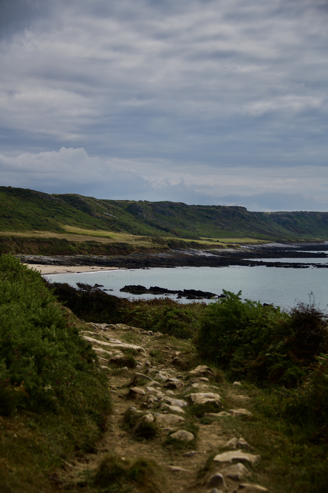
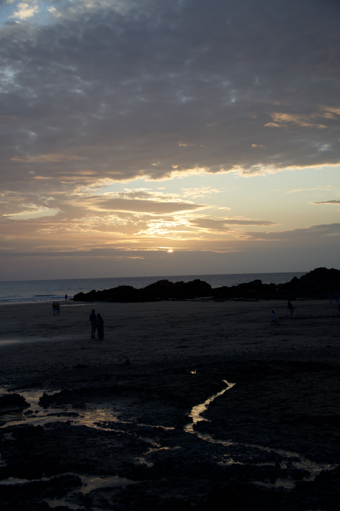

## Port Eynon

*Port Eynon*

On my first morning in Port Eynon, I wake almost with the dawn. I have slept like the dead, but the gaps in my curtains have cast a cold morning light onto my face, and my body has decided that this alarm is primal and unignorable. Although the room is new, the house I am staying in has the warm familiarity of a holiday home, a place I have stayed in for the last three years. I know the shape of the rooms and the furniture like I am returning to an old house I once lived in as a student. It is comparable aside from the fact that here, nothing changes, not the upholstery on the sofa cushions or the wooden bench in the back garden. 

From the house, I can walk less than five minutes to the tide, over dunes broken only by a stable wooden path buried under a thin layer of sand. The tide is low, far out across the vast expanse of beach. To the right, you can see the rocks that stretch into the sea, but here, where I am swimming, it is perfectly sandy. There are beautiful rivulets in the sand where the tide has retreated in the early morning, leaving behind the occasional limpet or string of seaweed. In the water, the waves are practically non-existent, and it is so clear that I can see beneath my feet shoals of tiny fish and crabs skuttling across the sea floor in the intricate spiralled shells of their home. If I look to the rocks spread across the sands and the cliffs overhanging them, the ocean shivers like grains of sand against one another, but turning back towards the sun I am met with a blank sheet of white, squinting against the light which wields itself like a scythe. I know that from the balcony of the house, the endless stretch of water will take on the appearance of glittered starlight, winking apparitions against the ghostly silhouette of Devon, sitting beneath the stringy clouds. 

*Along the Shore*

Port Eynon is a small village with a couple of fish and chip shops, a gift shop and two pubs. It is clear from the moment you arrive that you have stepped into a community. When the holidaymakers depart at the end of August, you feel almost certain that the pubs will still hold their social buzz on a Saturday evening, that the beach will still witness the exited thump of dog paws in the early morning sun. I swim in Port Eynon Bay, and Port Eynon Point, which is just besides, is the most southerly point in the Gower Peninsula. Just past the caravan park, you can find the derelict ‘salt house’ which was used for extracting salt from sea water, up to the mid-19th century. If you scramble up a little further and fight your way through the ferns like a traveller with need of a panga in the rainforest, you can reach the edge of the cliff, a fantastic place to view the sunset. 

*A Port Eynon Sunset*

In the sea, the peaceful water is disturbed. I am up to my shoulders, still shivering as I attempt to acclimatise with the cold. It is a dolphin, then a pod. Their streamlined bodies move further out from the shore, but I still see a pair leap and disappear again. It is early enough that I am almost entirely alone, but there is still a fellow swimmer who I can exclaim to. Although I am notoriously hostile towards dolphins, the experience of seeing them for myself, so unexpectantly and intimately, produces an unexpected wonder. A beautiful beach, comparatively calm to the Mumbles, thirty minutes through winding roads to the edge of Swansea, Port Eynon is a familiar and adored stretch of coastline in the Gower. 

